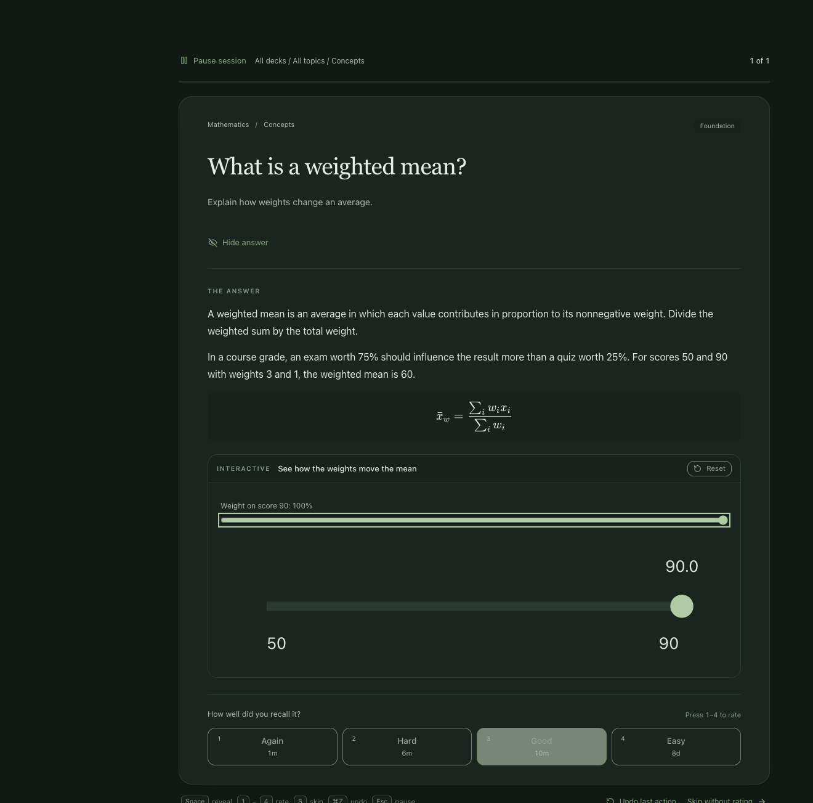
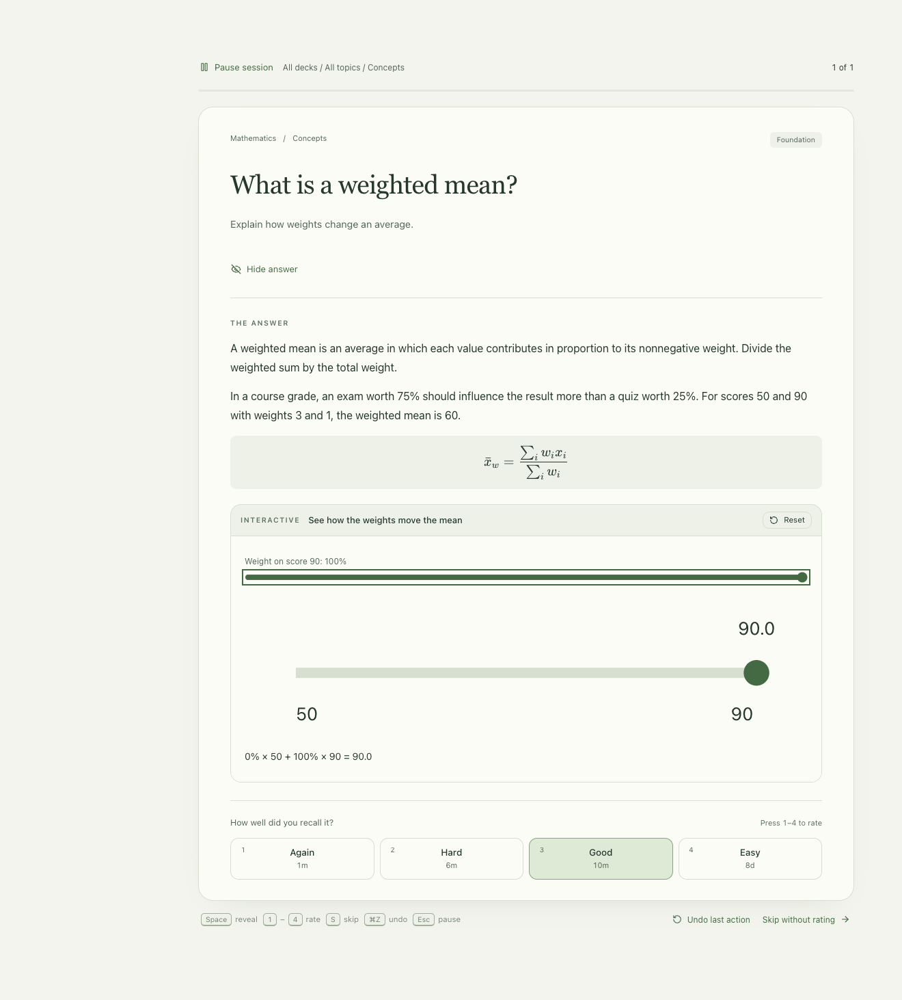

# Recall

**Turn what you learn into what you can recall.**

AI has made explanations abundant. We can explore more ideas than ever—but how much stays with us? Recall turns notes and learning sessions into opportunities to explain a concept, solve a problem, or write some code. Explore visual explanations, revisit difficult ideas, and build knowledge you can use.

A local Mac app and an optional learning skill kit. Forest Glass in the dark, warm ivory in the light. LaTeX, interactive diagrams, paper math, Python/C++ workspaces, and spaced repetition. Your cards and study progress stay on your machine.

**Learn → capture in your KB → author suitable questions → self-test → revisit gaps.**

<details><summary>See the original interactive demo</summary>





</details>

## Start the app

The beta is verified on Apple Silicon macOS. Development/authoring requires Node 22.18 or later with node:sqlite. Python 3 and Apple command-line tools (clang++) are needed only for their coding exercises. Other operating systems are not yet verified.

```sh
npm ci
npm run build
npm start
```

Use **Try the demo** to explore three original questions. New installs contain no private decks or imported third-party challenge collection. Existing libraries keep their cards and progress.

Study is local and works without an AI account. Authoring skills run in your chosen agent and may send selected notes to that provider. Nothing reads every conversation invisibly.

## Choose your workflow

- **Study only:** import an Anki deck or try the demo. No KB connection required.
- **Build a KB:** install the concept, question, deep-dive and learn skills; choose a local Markdown folder, Obsidian scope or connected Notion KB.
- **Create cards:** use the card/visual/math/code skills. Supplements are chosen per objective, not forced onto every term.
- **Daily self-test:** opt into capture and link the concepts you actually discussed to suitable questions.

See [Setup](docs/SETUP.md), [Authoring](docs/AUTHORING.md), [Knowledge sources](docs/KNOWLEDGE.md), [Widgets](docs/WIDGETS.md), [Privacy and execution](docs/PRIVACY.md), and [Migration and restore](docs/MIGRATION.md).

## Install the CLI and skills

From this checkout:

```sh
npm link
recall doctor
recall init
recall skills install /absolute/path/to/your/agent/skills
recall skills install /absolute/path/to/your/agent/skills --apply
```

Installation previews by default and refuses to overwrite existing skills. All eleven skills are also available under `skills/`, with an optional Codex plugin manifest in `.codex-plugin/`. Keep `recall-source` installed when choosing individual skills; it supplies their shared references. Installation does not edit global instructions or enable capture.

## Develop and verify

```sh
npm test
npm run build
npm run test:desktop
npm run audit:release
npm run package
```

Code uses the MIT license; the original demonstration content uses CC0-1.0. Imported content remains subject to its own terms. No affiliation with external knowledge-base or exercise providers is implied. See [CONTRIBUTING](CONTRIBUTING.md) and [SECURITY](SECURITY.md).

This beta supports additive card imports and revision-checked KB updates. A general card-revision editor, automatic handwriting grading, background bidirectional KB sync and signed/notarized distribution are not included.
