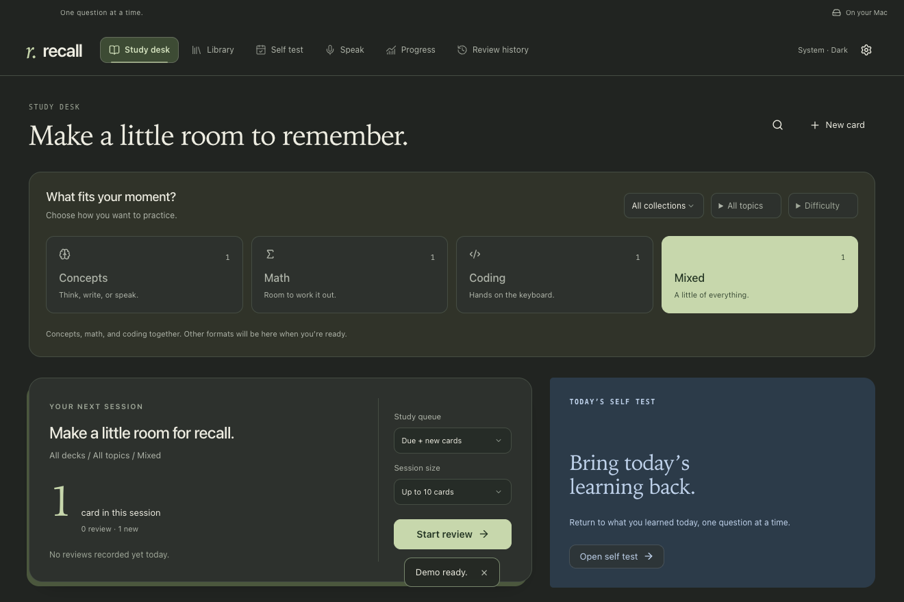

In the world of AI, we consume more text and move faster than ever. But how much do we actually learn and retain? Recall helps you continuously capture what you’re learning, log it, and test yourself—so more of it stays with you.

> “All of learning is anti-forgetting.”
>
> — [Andrew Huberman, Huberman Lab](https://www.hubermanlab.com/episode/your-top-health-questions-answered)

# Recall

**Turn what you learn into what you can recall.**

A quiet study desk for concepts, mathematics and code. Warm paper, visual explanations and a learning loop built around self-testing.

**Mac · Local first · Light & dark · Your own knowledge**

[](https://github.com/justslee/recall/actions/workflows/verify.yml)

[Get started](#start-in-five-minutes) · [Connect your learning](#connect-your-learning) · [Daily workflow](docs/WORKFLOW.md) · [All guides](docs/README.md)

|                                                                          Light                                                                          |                                                  Dark                                                   |
| :-----------------------------------------------------------------------------------------------------------------------------------------------------: | :-----------------------------------------------------------------------------------------------------: |
|  |  |

_Appearance follows your Mac. Screenshots use original demo content._

## Start in five minutes

**You need:** an Apple Silicon Mac, macOS 13 or later, and [Node.js 22 LTS](https://nodejs.org/en/download). Version 22.23.3 or later is recommended; 22.18 is the functional minimum.

No account, API key or knowledge base is needed to try Recall. Setup needs internet; ordinary study works offline afterward.

```sh
git clone https://github.com/justslee/recall.git
cd recall
npm run setup
```

**Prefer a ZIP?** Choose **Code → Download ZIP**, unzip it, then open Terminal. Type `cd `, drag the unzipped folder into Terminal and press Return. Run `npm run setup`.

Setup checks your Mac, installs the locked dependencies, builds Recall and opens it. Choose your starting point:

| Start with…          | What happens                                  |
| :------------------- | :-------------------------------------------- |
| **Try demo**         | Study three original questions.               |
| **Import cards**     | Bring an Anki deck into **Library**.          |
| **Connect learning** | Set up your assistants and knowledge sources. |

Choose a format, select **Start review**, answer from memory, then flip and rate your recall. To reopen from the checkout, run `npm start`.

> [!TIP]
> Want an app in Applications and working **Open in Recall** links? Follow [Keep Recall in Applications](docs/SETUP.md#keep-recall-in-applications) before installing assistant connections.

This is an Apple Silicon source-build beta. A signed, notarized download and verified setup for other platforms are not yet available.

## Choose the practice you have room for

| Format       | Your task                                   | What helps                                           |
| :----------- | :------------------------------------------ | :--------------------------------------------------- |
| **Concepts** | Explain the idea from memory.               | A definition, concrete example and useful visual.    |
| **Math**     | Solve on paper or enter a numerical answer. | The worked solution, revealed when you choose.       |
| **Coding**   | Solve a focused Python or C++ challenge.    | Starter code, tests and a hidden reference solution. |
| **Mixed**    | Combine the formats that fit your session.  | Each question keeps its own review schedule.         |

Filter by **topic** or **collection** independently of format. Cards support LaTeX, images and interactive diagrams; math and code supplements are added only when they test a useful objective.

Your **Again / Hard / Good / Easy** rating drives spaced repetition. **Progress** shows study activity and cards needing practice; **Review history** keeps actual attempts visible. [Coding tools are optional](docs/SETUP.md#optional-coding-runtimes).

## Connect your learning

Recall includes the app **and** a [portable skill kit](skills/) for Codex and Claude Code. Start with study alone, or connect the full loop:

**Learn → capture → self-test → revisit.**

1. **Connect your assistant.** Open **Settings & backups → Learning connections**. Choose **Connect**, review the installation, then **Install connection**. Enable capture, save your learning timezone and start a **fresh assistant session**. Connections work across your local projects; you do not need to stay in the Recall repository.
2. **Choose a home for your knowledge—optional.** Under **Knowledge sources**, use **Create my first knowledge base** for Markdown, Obsidian, Notion or several together. Choose a primary home and optional mirrors. For existing notes, use **Add knowledge source**, select the scope and access, then **Test connection**. [Knowledge source guide](docs/KNOWLEDGE.md).
3. **Verify the whole loop.** Choose **Check readiness**, then **Verify learning → Create verification prompt → Copy prompt**. Paste it into your fresh assistant session. Installation, CLI, sign-in and an actual learning receipt are checked separately.

Notion also needs your assistant's working Notion connector. Finish its setup with the copied assistant prompt; it remains pending until a real creation and read-back receipt is registered. Mirrors follow verified primary writes through the skills, rather than continuous two-way sync.

Try a real learning question from any connected project:

> Explain weighted means with a concrete example. Use my installed Recall learning skills to search my selected KB, reuse suitable cards, assess useful math or coding supplements, and capture only what we discuss. Return new, reused or pending outcomes with verified Recall links.

Ready reused cards can enter today's **Self Test** immediately. Missing objectives wait in the **Learning inbox** for authoring and validation. For blocked work, **Finish with assistant** copies a scoped handoff; **Retry** handles a transient failure.

> [!NOTE]
> Capture is opt-in. It records learning you discussed, never inferred mastery or automatic ratings. Say **“Don't capture this discussion”** when you want to keep it out. [Complete connection workflow](docs/WORKFLOW.md#2-connect-the-assistants-you-use).

## Make a little room to remember

1. **Learn normally.** Read, ask questions or build in your connected projects. Check the assistant's new/reused/pending receipt.
2. **Prepare the day's learning.** Ask your assistant to prepare today's Self Test from actually captured learning, respect capture pause, resolve validated card gaps and regenerate the daily Markdown log—without starting or rating a test.
3. **Test yourself.** Open **Self Test**, choose a learning day and a format. Earlier days remain available. Return to due cards in **Study desk**; your ratings update the original cards.

[Daily preparation and scheduling](docs/WORKFLOW.md#5-prepare-and-take-the-daily-self-test) · [Optional local catch-up](docs/WORKFLOW.md#6-catch-up-only-if-you-want-to)

### Practice saying it clearly

A compact **Speak / Type** strip lets you answer a card before **Evaluate & flip**. The separate **Speak** tab supports a card, KB note or your own topic, with audience-specific feedback, filler counts, approximate pauses and a focused retry. Accuracy needs a reference; practice does not change review schedules.

This optional feature uses your own OpenAI API key, saved once in **Settings & backups → Voice & feedback**. It requires internet and separate API billing. Recording sends audio to OpenAI; evaluation sends the selected reference and your response. Recall saves no audio. The key stays locally in an owner-only plaintext file, outside Recall exports and profile backups. [Voice setup & privacy](docs/VOICE.md) · [Speak guide](docs/SPEAK.md).

## Your learning stays yours

Your cards, reviews, photos, drafts and learning logs live in `~/Library/Application Support/Recall`, separately from this repository. A fresh profile contains none of the maintainer's notes, cards or credentials. Back up in **Settings & backups → Library & backups** before substantial upgrades.

Study requires no account, hosted database or telemetry service. Optional AI requests send selected context to the provider. Profile backups and library exports can contain private learning material; keep them private.

Interactive widgets load only when requested in a sandbox without network or privileged app access. Coding runs only after local source review and an explicit **Run** action. [Privacy & execution](docs/PRIVACY.md) · [Security](SECURITY.md).

## Documentation

| You want to…                                    | Read                                                                                                                |
| :---------------------------------------------- | :------------------------------------------------------------------------------------------------------------------ |
| Set up, install or fix a connection             | [Setup](docs/SETUP.md) · [Troubleshooting](docs/TROUBLESHOOTING.md)                                                 |
| Connect assistants and build a daily habit      | [Complete workflow](docs/WORKFLOW.md)                                                                               |
| Create a KB or connect your notes               | [Knowledge sources](docs/KNOWLEDGE.md)                                                                              |
| Author cards, math, code and visuals            | [Authoring](docs/AUTHORING.md) · [Interactive visuals](docs/WIDGETS.md)                                             |
| Move or restore your library                    | [Migration & restore](docs/MIGRATION.md)                                                                            |
| Develop, contribute or review release readiness | [Contributing](CONTRIBUTING.md) · [Implementation](docs/IMPLEMENTATION.md) · [Public review](docs/PUBLIC_REVIEW.md) |

Built by [justslee](https://github.com/justslee). Code is **MIT**; original demo content is **CC0-1.0**. Imported material retains its own terms. Recall is not affiliated with the services it connects to.
