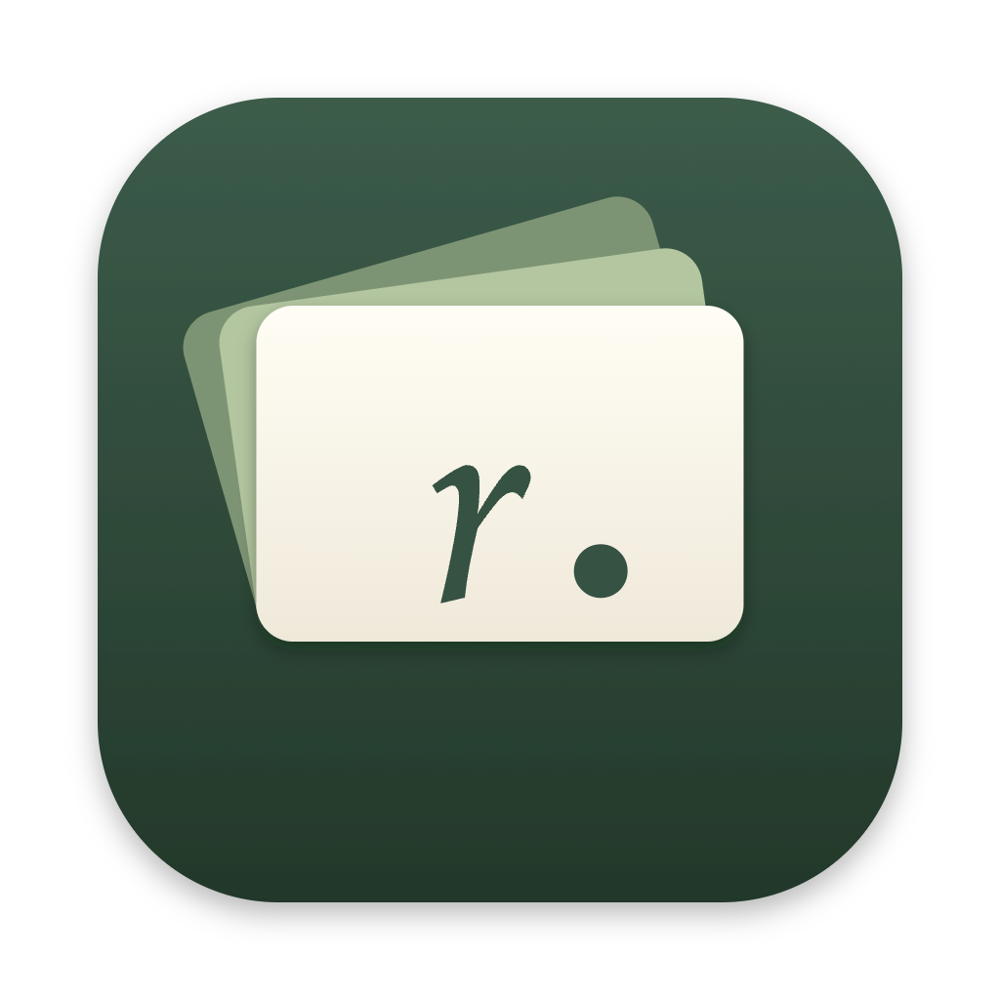
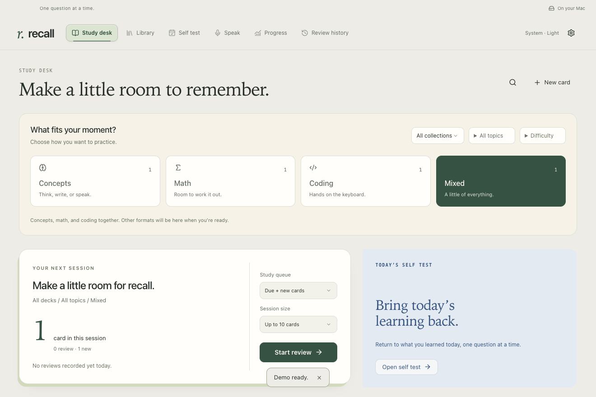

<div align="center">



# Recall

### Turn what you learn into what you can recall.

A study desk for concepts, mathematics and code.<br>
Warm paper. Quiet cards. Your own knowledge.

**Mac · Local first · Visual explanations · Light & dark**

[Start in five minutes](#start-in-five-minutes) · [Connect your learning](#connect-your-learning) · [Make-it-yours guide](docs/WORKFLOW.md) · [Documentation](#documentation)

<picture>
  <source media="(prefers-color-scheme: dark)" srcset="docs/images/study-desk-dark.png">
  <source media="(prefers-color-scheme: light)" srcset="docs/images/study-desk-light.png">
  
</picture>

<sub>Original demo content. Appearance follows your Mac.</sub>

</div>

AI makes explanations abundant. Recall helps you find out what stayed with you. Explain an idea from memory, solve a relevant problem or implement it in code. Test yourself, understand the gaps, and return to them.

**Learn → capture → self-test → revisit.**

## Choose how you want to study

| Concepts                                                         | Math                                                                    | Coding                                                                   | Mixed                                                     |
| :--------------------------------------------------------------- | :---------------------------------------------------------------------- | :----------------------------------------------------------------------- | :-------------------------------------------------------- |
| Recall the idea, then flip to its explanation.                   | Solve on paper or enter a numerical answer, then reveal numbered steps. | Solve a focused Python or C++ challenge in the matching editor.          | Combine the formats you have time and space for.          |
| Definitions, examples, LaTeX and purposeful interactive visuals. | Difficulty labels, worked solutions and photo attachments.              | Imports, function signatures, reference solutions and behavioural tests. | Choose a topic or collection to keep the session focused. |

Each question has its own spaced-repetition schedule. Math and coding supplements are added when they test a useful objective; every concept does not need all three.

**Self Test** gathers the learning you captured on a chosen day. **Progress** shows study activity and cards that need practice. **Review history** lets you revisit actual ratings. Your rating always controls the schedule.

## Start in five minutes

**Requirements:** an Apple Silicon Mac running macOS 13 or later, and [Node.js 22.18 or later](https://nodejs.org/en/download). Setup needs internet to download dependencies and the app runtime. Ordinary study works offline afterward.

1. On this repository's GitHub page, choose **Code → Download ZIP** and unzip it, or use its clone URL.
2. Open Terminal, type `cd `, drag the unzipped Recall folder into the window, and press Return.
3. Run:

```sh
npm run setup
```

Setup checks your Mac, installs the locked dependencies, builds Recall and opens it. It does not connect assistants or enable learning capture.

4. Choose **Try the demo** for three original questions. Pick **Concepts**, **Math**, **Coding** or **Mixed**, then **Start review**. Coding needs the optional tools below.
5. Flip to the answer when ready and choose **Again / Hard / Good / Easy**. Open **Progress** after reviewing.

To open the checkout again:

```sh
npm start
```

Your library is in `~/Library/Application Support/Recall`, separately from this repository. A fresh profile contains no personal cards, knowledge-base content or credentials. Back up through **Settings & backups → Library & backups** before substantial upgrades.

<details>
<summary><strong>Open Recall like a normal Mac app</strong></summary>

After setup:

```sh
npm run package
```

Move `release/Recall-darwin-arm64/Recall.app` into Applications and open it. Quit a running development copy first. Launching the packaged app registers `recall://card/…` links. Connect assistants from this final app location; reconnect if you move it later.

This is a source-build beta. A signed, notarized download is not available yet. Intel Macs and other operating systems do not yet have a verified setup path.

</details>

<details>
<summary><strong>Optional coding tools</strong></summary>

Recall resolves its standard Python and C++ runtimes through Apple's Command Line Tools. Install them explicitly if you want to run coding exercises:

```sh
xcode-select --install
```

Then check the detected runtimes:

```sh
node cli/recall.cjs doctor
```

Standard exercises need no Python packages. Scientific Python cards can use a separate environment with NumPy; see [runtime setup](docs/SETUP.md#optional-coding-runtimes). No dependencies are downloaded when you open a card. Imported coding exercises require an explicit local code review and validation before **Run** is enabled.

</details>

## Connect your learning

The repository includes the app **and** its reusable learning skills. To build the complete workflow, opt into the pieces you want:

| Piece               | Set it up once                                                                                                                                                                         | What it does                                                                                                                  |
| :------------------ | :------------------------------------------------------------------------------------------------------------------------------------------------------------------------------------- | :---------------------------------------------------------------------------------------------------------------------------- |
| Codex / Claude Code | **Settings & backups → Learning connections** → **Connect** → review → **Install connection**. Enable capture, check your learning timezone and save. Start a fresh assistant session. | Connects substantive learning from other local projects to this library. Reuses suitable cards and queues missing objectives. |
| Your knowledge base | Configure a selected Markdown folder, Obsidian scope or Notion page/database. [Follow the guide](docs/KNOWLEDGE.md).                                                                   | Gives the assistant scoped reference material and optional permission to write.                                               |
| Daily Self Test     | Ask your connected assistant to prepare today's captured learning. Optionally schedule it in that assistant's automation system.                                                       | Links ready cards to the learning day and produces a Markdown log. Scheduling is a separate opt-in.                           |
| Catch-up            | In **Learning connections**, enable it and choose a start time, projects and exclusions.                                                                                               | Inspects supported local Codex/Claude session records while Recall is open.                                                   |
| Spoken feedback     | **Settings & backups → Voice & feedback** → save your own OpenAI API key.                                                                                                              | Enables dictation and reference-grounded feedback, plus the separate **Speak** practice tab.                                  |

Start with this in a fresh, connected assistant session:

> Explain how a weighted mean differs from an ordinary average, with a concrete example. Capture what we discuss in Recall, reuse suitable cards, assess whether a math or coding question would help, and return verified card links.

Then look in **Self Test** and the **Learning inbox** under Settings. Reused cards are available immediately. Missing cards remain pending until prepared and validated.

**Prepare next** previews one item's provider context. Its restricted worker has no shell, browser or connector tools. If an item needs visual interaction checks, calculations or code execution, ask your normal assistant to finish it with the included skills; blocked checks stay visible. Desktop preparation requires a supported, signed-in Codex or Claude CLI, separately from the Recall app.

The [make-it-yours guide](docs/WORKFLOW.md) walks through the complete workflow, including a canonical KB, an optional mirror, daily preparation and how to verify each step.

### Speak, type or explain to an audience

Concept and math cards have a compact **Speak / Type** strip. The editor opens when needed; **Evaluate & flip** compares your response with the card reference and turns to the back. You can edit your transcript, inspect feedback and try a follow-up. Typed drafts work without an API key.

In **Speak**, choose a card, a configured KB note or **Your own topic**. Explain it to a chosen audience, from a short definition to a 15-minute presentation. Feedback covers communication, observed fillers, pace and approximate pauses. Factual accuracy is assessed only when you supply a reference. Speak practice does not change card schedules.

Both use the same optional [OpenAI API connection](https://platform.openai.com/api-keys). Internet and separate API billing are required; a ChatGPT subscription does not cover it. Recording sends audio to OpenAI; evaluation sends the selected reference and your response. Recall saves no audio and keeps drafts locally. Save your own key once in **Settings & backups → Voice & feedback**; it persists across restarts and updates in a local plaintext `credentials/openai.key` file with owner-only permissions. Recall does not access macOS Keychain for this connection. [Voice](docs/VOICE.md) · [Speak](docs/SPEAK.md) · [Privacy](docs/PRIVACY.md).

## What is included—and what you connect

The shared [skill kit](skills/) covers KB concepts, quick questions, deeper teaching, learning programs, visual cards, relevant math/coding exercises, quality review and daily Self Tests. The connection installer copies it automatically and installs a global bridge instruction, preserving other instructions with backups.

Your cards, KB paths, Notion scope, assistant login, API key and automation preferences belong to your own setup. Connecting Notion uses your assistant's Notion connector; Recall does not bundle Notion OAuth. You can choose Notion as canonical and mirror successful writes to Obsidian, or simply use local Markdown. These sources are configured explicitly; continuous two-way sync is not implemented.

Capture follows assistant instructions and optional local records. It cannot guarantee every conversation was logged or retrieve unavailable/cloud-only history. Only captured learning is represented as covered.

## Private by default

Cards, review history, photos, drafts and learning logs stay in the local profile. Study needs no account, hosted database or telemetry service. Optional AI features send selected context to the chosen provider.

Sharing this source does not share your library. **Profile backups and library exports can contain private learning material**; keep them private. The OpenAI key is excluded from Recall's exports and profile backups; whole-machine backups may include it. It is plaintext on disk, so software running as your OS account can read it despite owner-only permissions. Public screenshots and examples use only original demo content.

Interactive widgets load on request in a sandbox with no network or privileged app access. Reviewed Python/C++ exercises run only on **Run**, inside the supported macOS sandbox. [Privacy and execution](docs/PRIVACY.md) · [Security](SECURITY.md).

## Documentation

| I want to…                                       | Start here                                                                    |
| :----------------------------------------------- | :---------------------------------------------------------------------------- |
| Recreate the complete learning workflow          | [Make it yours](docs/WORKFLOW.md)                                             |
| Configure a profile, time zone or coding runtime | [Setup](docs/SETUP.md)                                                        |
| Connect Markdown, Obsidian or Notion             | [Knowledge sources](docs/KNOWLEDGE.md)                                        |
| Create visual, math or coding questions          | [Authoring](docs/AUTHORING.md)                                                |
| Build interactive diagrams                       | [Widget contract](docs/WIDGETS.md)                                            |
| Speak and practise explanations                  | [Voice](docs/VOICE.md) · [Speak](docs/SPEAK.md)                               |
| Move or restore a library                        | [Migration & restore](docs/MIGRATION.md)                                      |
| Fix setup or connection problems                 | [Troubleshooting](docs/TROUBLESHOOTING.md)                                    |
| See verification and remaining release work      | [Implementation](docs/IMPLEMENTATION.md) · [Launch checklist](docs/LAUNCH.md) |
| Contribute or report a security issue            | [Contributing](CONTRIBUTING.md) · [Security](SECURITY.md)                     |

<details>
<summary><strong>CLI and development</strong></summary>

The CLI works directly from the checkout; no global npm installation is required:

```sh
node cli/recall.cjs doctor
node cli/recall.cjs cards search "weighted mean"
node cli/recall.cjs connections status
node cli/recall.cjs inbox status
```

`npm link` optionally provides the short `recall` command. The connection installer also creates a profile-specific launcher for your assistant.

`npm run setup -- --check` checks prerequisites only. `npm run setup -- --no-launch` installs and builds without opening a profile.

```sh
npm test
npm run build
npm run test:desktop
npm run test:connections
npm run audit:release
```

Use `RECALL_DATA_DIR=/absolute/test-profile npm start` for an isolated library. Direct card import, backup, restore and trust actions require the app to be closed. Inbox capture/submission and read-only searches work while it is open.

</details>

**Beta boundaries:** Apple Silicon macOS; source build; optional integrations. Automatic handwriting grading, continuous KB sync, general card-content revisions, signed distribution and other platforms remain future work. See [public-readiness review](docs/PUBLIC_REVIEW.md) for tested scope and remaining acceptance checks.

Code is **MIT**. Original demo content is **CC0-1.0**. Imported material retains its own terms. Recall is not affiliated with the services it can connect to.
